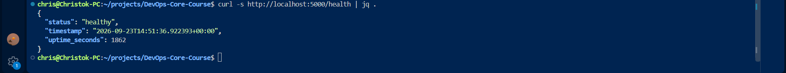
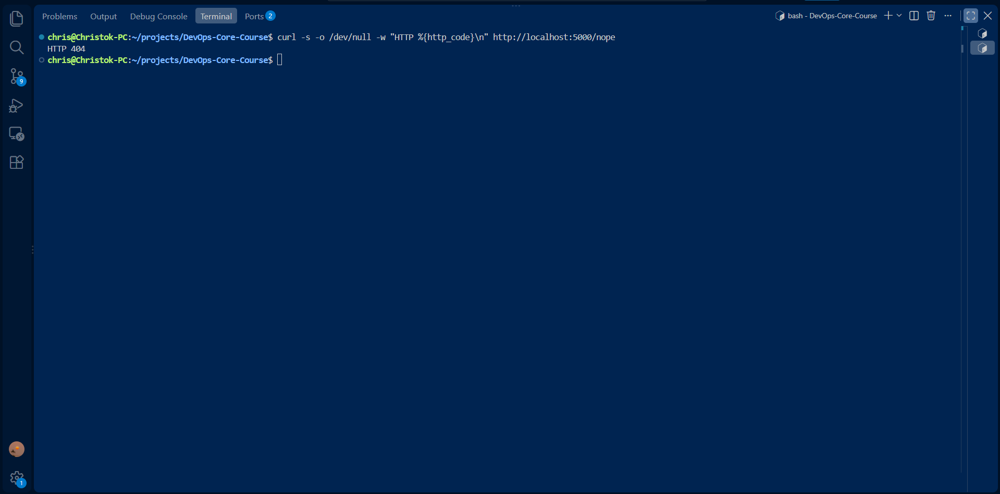
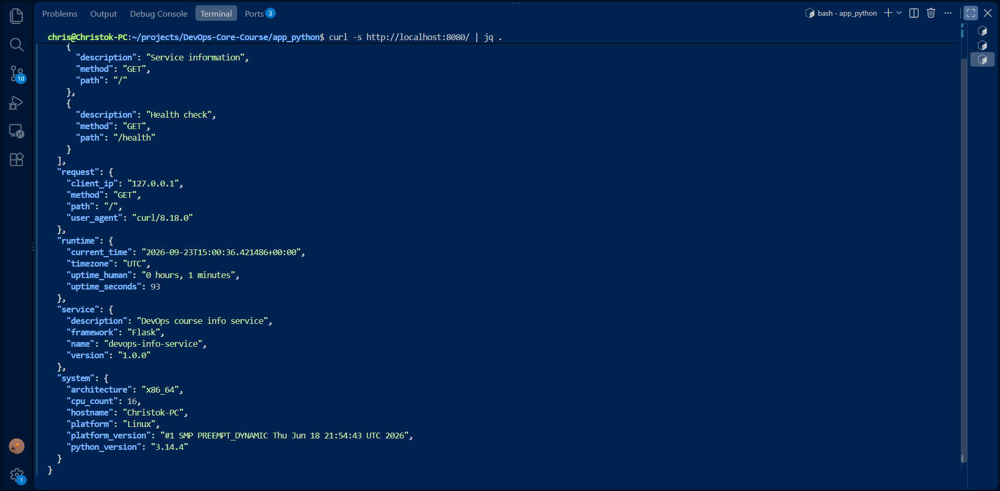

1. curl -s http://localhost:5000/ | jq .
2. curl -s http://localhost:5000/health | jq .
3. curl -s -o /dev/null -w "HTTP %{http_code}\n" http://localhost:5000/nope
4. PORT=8080 python app.py

Les images  de l'exécution de ces commandes sont dans le dossier images

# LAB01 — DevOps Info Service

## 1. Sélection du cadre de travail

Pour ce projet, j'ai choisi **Flask** comme framework Python.

Flask est un framework web léger et minimaliste qui permet de créer rapidement une API HTTP. Pour un service aussi petit que celui demandé dans ce laboratoire, Flask permet de rester simple tout en fournissant les fonctionnalités nécessaires : création de routes, gestion des réponses JSON, gestion des erreurs et récupération des variables d'environnement.

### Tableau comparatif

| Critère                       | Flask                       | FastAPI                 | Django                                     |
| ----------------------------- | --------------------------- | ----------------------- | ------------------------------------------ |
| Simplicité                    | Très simple                 | Simple                  | Plus complexe                              |
| Installation et configuration | Légère                      | Légère                  | Plus importante                            |
| Création d'une API REST       | Très adaptée                | Excellente              | Possible mais plus complète que nécessaire |
| Documentation automatique     | Non native                  | Oui, Swagger/OpenAPI    | Non native                                 |
| Validation des données        | À ajouter selon les besoins | Intégrée avec Pydantic  | Intégrée via différents composants         |
| Performance                   | Bonne                       | Très bonne              | Bonne                                      |
| Architecture                  | Minimaliste et flexible     | Moderne et orientée API | Framework complet                          |
| Adaptation à ce projet        | **Très adaptée**            | Adaptée                 | Surchargée pour ce projet                  |

Pour ce laboratoire, Flask représente un bon compromis entre simplicité, lisibilité et fonctionnalités nécessaires. FastAPI serait particulièrement intéressant pour une API plus importante nécessitant une validation avancée et une documentation OpenAPI automatique, tandis que Django serait davantage adapté à une application web complète avec davantage de fonctionnalités intégrées.

---

## 2. Meilleures pratiques appliquées

* **Utilisation des variables d'environnement**
  Le `HOST`, le `PORT` et le mode `DEBUG` sont récupérés avec `os.getenv()`, ce qui permet de modifier la configuration de l'application sans modifier directement le code source.

* **Valeurs par défaut pour la configuration**
  Des valeurs par défaut sont définies pour `HOST`, `PORT` et `DEBUG`, ce qui permet de démarrer l'application même lorsque les variables d'environnement ne sont pas définies.

* **Utilisation de `logging` plutôt que de simples `print()`**
  Le module `logging` permet de produire des messages structurés avec différents niveaux de gravité et facilite le diagnostic de l'application.

* **Utilisation de réponses JSON**
  Les différents endpoints utilisent `jsonify()` afin de retourner des réponses structurées et facilement exploitables par un client ou une autre application.

* **Gestion explicite des erreurs HTTP**
  Des gestionnaires sont définis pour les erreurs 404 et 500 afin de retourner des réponses JSON cohérentes plutôt que des pages HTML par défaut.

* **Utilisation de l'UTC pour les timestamps**
  Les dates sont générées avec `datetime.now(timezone.utc)` afin d'éviter les ambiguïtés liées aux fuseaux horaires.

* **Séparation des informations système et runtime**
  Les informations retournées par l'endpoint `/` sont organisées en plusieurs catégories (`service`, `system`, `runtime`, `request` et `endpoints`), ce qui rend la réponse plus lisible et structurée.

* **Calcul de l'uptime à partir du démarrage de l'application**
  La variable `START_TIME` permet de calculer la durée de fonctionnement du service depuis son lancement.

* **Documentation des endpoints dans le code**
  La liste `ENDPOINTS` permet de centraliser les informations concernant les endpoints disponibles et leur description.

---

## 3. Documentation API

### `GET /`

Cet endpoint retourne les informations générales du service, les informations du système, les informations d'exécution, les informations concernant la requête et la liste des endpoints disponibles.

#### Exemple de requête

```bash
curl -s http://localhost:5000/ | jq .
```

#### Exemple de réponse

```json
{
  "service": {
    "name": "devops-info-service",
    "version": "1.0.0",
    "description": "DevOps course info service",
    "framework": "Flask"
  },
  "system": {
    "hostname": "HOSTNAME",
    "platform": "Linux",
    "platform_version": "VERSION",
    "architecture": "x86_64",
    "cpu_count": 4,
    "python_version": "3.x.x"
  },
  "runtime": {
    "uptime_seconds": 120,
    "uptime_human": "0 hours, 2 minutes",
    "current_time": "2026-09-23T...",
    "timezone": "UTC"
  },
  "request": {
    "client_ip": "127.0.0.1",
    "user_agent": "curl/...",
    "method": "GET",
    "path": "/"
  },
  "endpoints": [
    {
      "path": "/",
      "method": "GET",
      "description": "Service information"
    },
    {
      "path": "/health",
      "method": "GET",
      "description": "Health check"
    }
  ]
}
```

> Les valeurs liées au système, à l'hostname, à la version de Python, à l'adresse IP, au User-Agent et à l'heure sont dynamiques et dépendent de l'environnement d'exécution.

### `GET /health`

Cet endpoint permet de vérifier rapidement que le service fonctionne correctement.

#### Exemple de requête

```bash
curl -s http://localhost:5000/health | jq .
```

#### Exemple de réponse

```json
{
  "status": "healthy",
  "timestamp": "2026-09-23T...",
  "uptime_seconds": 120
}
```

Le code HTTP retourné est `200`.

### `GET /nope`

Cet endpoint n'existe pas. Il permet donc de vérifier le gestionnaire d'erreur 404.

#### Exemple de requête

```bash
curl -s -o /dev/null -w "HTTP %{http_code}\n" http://localhost:5000/nope
```

#### Exemple de résultat

```text
HTTP 404
```

L'application dispose également d'un gestionnaire d'erreur qui retourne une réponse JSON pour les routes inexistantes :

```json
{
  "error": "Not Found",
  "path": "/nope"
}
```

---

## 4. Preuves de test

Les tests suivants ont été exécutés depuis la ligne de commande afin de vérifier le comportement de l'application.

### 4.1 Endpoint principal

Commande exécutée :

```bash
curl -s http://localhost:5000/ | jq .
```

Cette commande permet de vérifier que le service retourne correctement les informations du service, du système, du runtime et de la requête.


### 4.2 Health check

Commande exécutée :

```bash
curl -s http://localhost:5000/health | jq .
```

Cette commande vérifie que le service est opérationnel et retourne le statut `healthy`.



### 4.3 Gestionnaire 404

Commande exécutée :

```bash
curl -s -o /dev/null -w "HTTP %{http_code}\n" http://localhost:5000/nope
```

Résultat attendu :

```text
HTTP 404
```

Cette commande permet de vérifier que l'application gère correctement les requêtes vers des routes inexistantes.



### 4.4 Configuration du port avec une variable d'environnement

L'application utilise la variable d'environnement `PORT` afin de permettre la modification du port d'écoute sans modifier le code source.

Commande exécutée dans un premier terminal :

```bash
PORT=8080 python3 app.py
```

Puis, dans un second terminal :

```bash
curl -s http://localhost:8080/ | jq .
```

Cette manipulation permet de vérifier que l'application peut être démarrée sur un port différent de sa valeur par défaut grâce à une variable d'environnement.



---

## 5. Défis et solutions

L'un des principaux problèmes rencontrés lors du lancement de l'application concernait la commande utilisée pour démarrer Python. La commande indiquée dans le laboratoire était `python app.py`, mais mon environnement Linux ne disposait pas de la commande `python` et proposait uniquement `python3`.

J'ai donc utilisé `python3` pour lancer l'application :

```bash
PORT=8080 python3 app.py
```

Un autre point vérifié pendant le laboratoire a été la configuration dynamique du port. L'application utilise `os.getenv("PORT", "5000")`, ce qui permet d'utiliser `5000` par défaut tout en pouvant remplacer cette valeur avec une variable d'environnement. J'ai vérifié ce comportement en lançant l'application sur le port `8080`, puis en envoyant une requête avec `curl` vers ce nouveau port.

---

## 6. Communauté GitHub

La communauté GitHub constitue une ressource importante pour progresser sur les technologies utilisées dans le développement et le DevOps. Les dépôts open source permettent notamment de consulter de la documentation, d'étudier différentes implémentations, de suivre les problèmes rencontrés par d'autres développeurs et de comparer les bonnes pratiques utilisées dans des projets réels.

Dans le cadre de ce laboratoire, GitHub permet également de conserver les travaux réalisés, de documenter les choix techniques et de rendre les exercices reproductibles. L'utilisation de Git et GitHub fait ainsi partie intégrante de la démarche DevOps en facilitant le suivi des modifications et le partage du travail.
